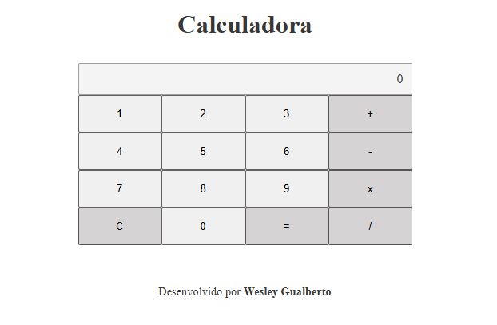

# 📟 Calculadora Simples em JavaScript

Uma calculadora interativa desenvolvida com **HTML**, **CSS** e **JavaScript puro**, capaz de realizar operações matemáticas básicas: **adição, subtração, multiplicação e divisão**. O projeto é ideal para praticar manipulação do DOM, eventos e lógica com arrays.

🔗 Acesse o projeto online: [Calculadora - GitHub Pages](https://wesleygualberto.github.io/calculadora/)

---

## 📸 Demonstração

 <!-- substitua por uma imagem real do seu projeto ou gif -->

---

## 🚀 Funcionalidades

* ✅ Inserção de múltiplos números
* ✅ Operações básicas: `+`, `-`, `x`, `/`
* ✅ Exibição do resultado final ao clicar em "="
* ✅ Botão "C" para limpar os dados
* ✅ Tratamento de erros (divisão por zero, operação inválida, etc.)

---

## 🛠️ Tecnologias

* **HTML5**
* **CSS3**
* **JavaScript (ES6)**

---

## 📂 Estrutura de Arquivos

```
📁 calculadora
├── index.html
├── style.css
├── script.js
└── README.md
```

---

## ▶️ Como Usar

1. Clone o repositório:

```bash
git clone https://github.com/WesleyGualberto/calculadora.git
```

2. Abra o arquivo `index.html` no navegador

Ou acesse diretamente: [https://wesleygualberto.github.io/calculadora/](https://wesleygualberto.github.io/calculadora/)

---

## ✨ Aprendizados

Este projeto foi criado para exercitar:

* Manipulação de eventos no DOM
* Uso de `reduce()` para calcular resultados
* Organização de código usando funções e objetos
* Boas práticas com funções puras e tratamento de erros

---

## 📌 Possíveis Melhorias Futuras

* Suporte a teclado
* Histórico de cálculos
* Tema escuro/claro
* Melhor responsividade para mobile

---

## 🧑‍💻 Autor

**Wesley Gualberto**
📧 [wesleygualberto0@gmail.com](mailto:wesleygualberto0@gmail.com)
🔗 [GitHub](https://github.com/WesleyGualberto)

Repositório: [https://github.com/WesleyGualberto/calculadora](https://github.com/WesleyGualberto/calculadora)

---

## 📃 Licença

Este projeto está sob a licença [MIT](LICENSE).
